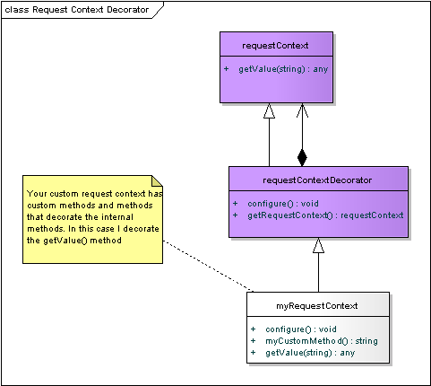

# Request Context Decorator

The **request context object** is bound to the framework release and as we all know, each application is different in requirements and architecture. Thus, we have the application of the [Decorator Pattern](https://www.tutorialspoint.com/design\_pattern/decorator\_pattern.htm) to our request context object in order to help developers program to their needs.&#x20;

So what does this mean? Plain and simply, you can decorate the ColdBox request context object with one of your own. You can extend the functionality to the specifics of the software you are building. You are not modifying the framework code base, but extending it and building on top of what ColdBox offers you.


"A decorator pattern allows new/additional behavior to be added to an existing method of an object dynamically." **Wikipedia**


### Creating The Decorator

The very first step is to create your own request context decorator component. You can see in the diagram below of the ColdBox request context design pattern.




Create a component that extends `coldbox.system.web.context.RequestContextDecorator`, this is to provide all the functionality of an original request context decorator as per the design pattern. Once you have done this, you will create a `configure()` method that you can use for custom configuration when the request context gets created by the framework. Then it’s up to you to add your own methods or override the original request context methods.


**Tip**: In order to access the original request context object you will use the provided method called: `getRequestContext()`.


#### Declaration

The following is a simple decorator class (`MyDecorator.cfc`) that auto-trims values when calling the `getValue()` method.  You can override methods or create new ones.


```java
component extends="coldbox.system.web.context.RequestContextDecorator"{
	
	function configure(){

		return this;
	}

	/**
	 * @overriden
	 * Get a value from the public or private request collection. and auto-trim it
	 * @name The key name
	 * @defaultValue default value
	 * @private Private or public, defaults public.
	 */
	function getValue( required name, defaultValue, boolean private=false ){
		var originalValue = "";

        // Check if the value exists via original object, else return blank
        if( getRequestContext().valueExists( arguments.name ) ){
            originalValue = getRequestContext().getValue( argumentCollection=arguments );
            // check if simple
            if( isSimpleValue( originalValue ) ){
                originalValue = trim( originalValue );
            }
        }

        return originalValue;
	}

}
```


As you can see from the code above, the possibilities to change behavior are endless. It is up to your specific requirements and it’s easy!

#### Leveraging The Controller

The request context decorator receives a reference to the ColdBox `controller` object and it can be retrieved by using the `getController()` method or via `variables.controller`. This will give you the ability to call settings, interceptions and much more, right from your decorator object.

### Configuration

Now that we have created our `MyDecorator.cfc` let's tell ColdBox to use the decorator open your `ColdBox.cfc` and add the following `coldbox` directive:

```java
coldbox = {
    requestContextDecorator = "models.system.MyDecorator";
};
```

The value of the setting is the instantiation path of your request context decorator CFC. That's it.  From now on the framework will use your request context decoration.
